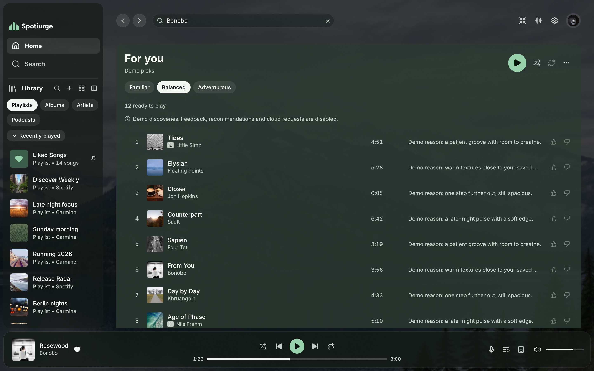

# Spotiurge

Serge's standalone personal fork of [Spotifast](https://github.com/crmne/spotifast),
written in Rust with native egui rendering, librespot playback and Spotify
Connect. Desktop supports macOS, Windows and Linux. A real-iPhone probe proved
17 minutes 22 seconds of independent locked playback. Production iOS and
TestFlight remain gated on the remaining audio checks and a distributable
dependency, with [the exact evidence recorded](docs/reviews/spotiurge-ios/playback-gate.md).

**Playback needs Spotify Premium.** Free accounts can browse and search, but
cannot play music through Spotiurge.

https://github.com/user-attachments/assets/a5f669ce-b3b7-4f8e-9933-976a78876c7e

The desktop interface shares T3 Pretty's forest/mist palette and quiet scenery
language. A landscape photo from Unsplash sits beneath a flat contrast wash,
with translucent navigation and controls, clear page content and a new
ridge-meter mark. **Settings → Appearance → Scenery** picks the photo set (World
Scenery, Night Cities, Deep Forest, Night Sky, Grand Buildings, or the bundled
Alpine Lake). Most pages show the set's photo of the day; album, artist,
playlist, show and radio pages show the photo whose colours best match the cover. The album-art colour setting retains a faint, flat tint in the
player console. No browser or continuous backdrop-blur pass is used.
Selection, navigation and control feedback use short, finite transitions.
**Settings → Appearance → Reduce motion**, or macOS Reduce Motion, shows changes
immediately. Optional Winamp skins retain their artwork.
See the [native before/after comparison](docs/reviews/spotiurge-scenery/index.html)
for light/dark themes, narrow windows and error states.

The inherited [Spotifast guide](https://spotifast.rocks/) explains the existing
desktop controls. It describes upstream releases, not Spotiurge downloads:

- [Getting started](https://spotifast.rocks/getting-started/): sign-in, playback on this computer, themes, fonts, proxies
- [Everyday use](https://spotifast.rocks/using-spotifast/): keyboard shortcuts, command-line control, updates
- [Settings and files](https://spotifast.rocks/settings-and-files/) and [Privacy](https://spotifast.rocks/privacy/)
- [How it connects](https://spotifast.rocks/how-it-connects/) and [What Spotify allows](https://spotifast.rocks/what-spotify-allows/)
- [Will my account get banned?](https://spotifast.rocks/what-is-spotifast/#will-my-spotify-account-get-banned)

## Install

No fork release has been published. Build this checkout with
`cargo build --locked`. The internal crate and executable still use `spotifast`;
launch `target/debug/spotifast`. Use `--no-default-features` to omit MilkDrop.
Updates target `SergeSerb2/Spotiurge`, never upstream. State and credentials are
isolated from Spotifast; sign in to Spotify again in Spotiurge. For a local Mac
bundle, run `python3 packaging/macos/dev-bundle.py target/debug/spotifast target/Spotiurge.app`.
Use `--identity` with an installed Apple Development identity for stable native
credential access. This creates a development bundle and does not publish,
notarize or register itself as the default Spotify link handler.
See [development DMG packaging](packaging/macos/README.md) for a universal Mac
preview and its signing/distribution limitations.

To authorize remotely, start Spotify sign-in in the Mac app, then run
`target/debug/spotifast sign-in-url` to retrieve the current authorization
request. After approval on another device, its localhost return URL must be
forwarded securely to this Mac before the ten-minute timeout. That URL contains
a temporary code: never post it publicly or include it in logs. The native
listener still validates state and PKCE; Spotiurge does not use a public OAuth
relay or store authorization callbacks. The fork has its own instance/control
namespace and Connect device name.

## Personal discovery

Home opens on a compact **For you** queue, intentional feedback and saved
Spotiurge mixes. **Tune taste** opens an optional editor; saving works locally.
Saved taste or feedback generates picks automatically on Home when the cache is
empty or twelve hours old. Choose **Familiar**, **Balanced** or **Adventurous**, or
use the **Find new picks** refresh control for a manual refresh. The menu can disable automatic picks.
Recommendations use **GPT-6 Luna only** through the private cloud's existing
CLIProxyAPI subscriptions, with no heavier-model fallback,
then validate title/credited-artist pairs with Spotify catalogue search. Matching
has a shared twenty-second deadline. One status distinguishes missing tracks,
unchecked suggestions, rate limits and interrupted searches. **Check again**
checks only unresolved suggestions without another AI request. Only matched
Spotify tracks can play through the existing local engine. Discovery URI-list
playback on remote Connect devices is disabled until a supported handoff is verified.
Existing Spotify playlist/album context handoff remains available.
**More like this** and **Less like this** affect the next recommendation request;
click a selected rating again to clear it. Feedback triggers a debounced refresh
after 45 seconds, at most once per ten minutes. AI failures retry after 10, 20,
40 minutes, up to six hours; pairing failures wait for a user action. When another
device holds the AI slot, retry waits only 15 seconds without increasing failure
backoff. Cached
music and playback stay available. Exploration and automatic-pick controls are
saved per device; taste and feedback synchronize through the private store.
**Save this mix** keeps an ordered Spotiurge mix without creating a Spotify
playlist. Home shows the eight newest saved mixes; **See more** reveals 24 more
at a time, and **Show less** returns to eight. **Sync my devices** exchanges taste preferences, feedback, mixes and AI
history. Previous discoveries remain cached when AI is unavailable. Local discovery
loads independently of proxy credential restoration. Exploration and edits stay
disabled until loading succeeds, preserving an unreadable state file. Feedback
retains the newest 500 records, counting cleared ratings. A shared logical cutoff
prevents forgotten ratings from returning from an old offline device. Older
feedback below that cutoff is discarded; a bounded local pending-stamp map keeps
new unsent ratings and clears across restarts, then advances them above the imported
cutoff or a conflicting remote rating before uploading. Upgrade
all devices to enforce this bound. Saved mixes and taste remain separate.
Saved mixes have a remove control. New saves reuse removed slots, then the
oldest slot once 100 mix slots exist, so repeated saves do not grow storage
without bound. Imported older mixes remain readable and removable. AI refresh,
including manual refresh, respects the service's retry cooldown.
Attempt times, pending feedback refreshes, pairing suspension and failure
cooldowns persist per device in the local discovery file, so restarting keeps
the same limits. They are excluded from cloud sync and AI prompts. A pending
attempt is saved before AI access; wall-clock restoration bounds clock changes.
Catalogue matching uses full Unicode case folding followed by NFC, retaining
accents and explicit remix/live versions.

Pair each desktop once by launching with `SPOTIURGE_CLOUD_TOKEN` in its process
environment. Obtain it from the private Railway service through a protected
channel; never paste it into a shell command or commit it. The app stores it in
Keychain, Credential Manager or Secret Service, bound to the HTTPS origin.
Startup consumes the pairing input and removes it from the process environment
before browser or visualizer helpers can inherit it.
`SPOTIURGE_CLOUD_URL` overrides the configured private service origin. The
CLIProxyAPI credential stays server-side. There are no direct-provider fallbacks.

AI receives the taste text and up to 100 intentional feedback records containing
track title, artist and rating. The service strips Spotify URIs. Account IDs,
Spotify grants, raw listening history, artwork and audio are not sent to AI.
The private store receives the synchronized document, including mix URIs and
AI suggestions; it receives no Spotify grants, audio or device pairing token in
the document. Networking follows the desktop proxy policy. Authenticated cloud
requests do not follow redirects. All integrations are bounded and off the UI
and playback threads.

Offline edits remain local until a manual sync. Same-record conflicts use a
logical counter and writer ID; separate records merge. Writer IDs rotate when
a profile is loaded, so copied profiles cannot share a live clock.
Edits made while synchronization is in flight stay local and are stamped above
the returned remote clock; they remain pending until the next sync.
Offline music downloads are not supported. See the [architecture and delivery plan](docs/_reference/spotiurge-architecture.md)
and [private service operations](services/private-cloud/README.md) for limits,
credential rotation, export and the iOS playback proof criteria.

Changing saved taste, listening feedback or exploration discards an in-flight
recommendation made from the previous inputs. Cached picks stay usable until a
fresh request completes; superseded work finishes before another request starts.

Automatic and manual updates are disabled in this preview, including the update
helper, until fork package identities and installer destinations are migrated.

## Contributing

Read [CONTRIBUTING.md](CONTRIBUTING.md) before opening an issue or pull
request. To look at the interface without a Spotify account, run
`cargo run --features demo -- --demo`. Translations live in `assets/i18n/`;
see [Translating Spotifast](docs/_reference/translating.md). Release
packaging is described in [PACKAGING.md](PACKAGING.md).

## Acknowledgements

Spotifast uses [librespot](https://github.com/librespot-org/librespot),
[egui](https://github.com/emilk/egui), the [Inter](https://rsms.me/inter/)
typeface (OFL), and [Lucide](https://lucide.dev) icons (ISC).

Spotiurge and Spotifast are independent projects and are not affiliated with Spotify.
Spotify is a trademark of Spotify AB.

Licensed under the [MIT License](LICENSE).
