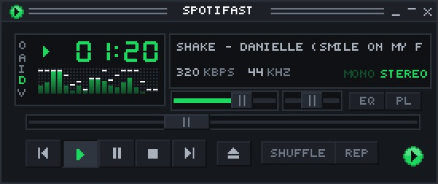

# First-slice verification

Recorded October 6, 2026 against fork main `e46f894` and this branch's candidate.
Read this separately from the synthetic [visual comparison](index.html).
The active scope is desktop discovery; Serge deferred iOS while remote.

| Platform/environment | Actually verified | Still unverified |
| --- | --- | --- |
| Apple Silicon Mac, macOS 27.2 (26B5091g) | Native UI; separate Web API/playback OAuth; independent librespot decoded playback with official Spotify closed; Connect both directions using a Spotify playlist; real CLIProxyAPI recommendation; saved mix; native Keychain pairing; cloud sync; full required local Rust checks | Human listening judgment, recommendation parity, sustained background/route testing, completed liquid-glass redesign |
| Windows 11 Pro Insider Preview 26340, direct LAN `windows-5080` | Native executable and production Rust probe build; authenticated live Railway sync; offline edit replay; concurrent conflict convergence; native Credential Manager pairing and restore in the existing interactive user session | Native UI screenshots, playback/audio, full local Windows suite |
| Intel Mac | Universal release target build and package validation are recorded below | Launch and playback on real Intel hardware |
| Linux | Target-specific native store remains isolated; existing CI matrix retained | Local native build, Secret Service round trip and Flatpak runtime test |
| iPhone/iOS/TestFlight | Signing-team and gate plan documented; no production framework chosen | Every real-phone playback/background/sync test, archive and TestFlight upload |

## Authenticated Mac workflow

Spotiurge uses its own local state, protected credential service and instance
namespace. Both distinct Spotify grants were approved remotely by Serge. The
native loopback listeners accepted the returned codes only after state/PKCE
validation. Neither authorization responses nor secrets are committed.

The app received twelve real model suggestions from the deployed private broker.
Spotify exact title/artist matching verified two playable tracks: “Danielle
(smile on my face)” and “WANT NEED LOVE.” Ten suggestions remained unverified
under repeated catalogue 429 responses. They remain visible and cannot play.
One shared twenty-second catalogue deadline retains partial results instead of
discarding all suggestions after a long rate-limit wait. Regression tests reject
wrong titles/artists, unavailable tracks, invented URIs and duplicate matches.
This is an integration result, not evidence of recommendation quality.

Playing a verified discovery started the local librespot engine. The official
Spotify app was then quit; Spotiurge continued advancing position and producing
a nonzero native decoded-audio spectrum. Its mini-player showed 320 kbps / 44 kHz
and progressed from 1:06 to 1:20. The screenshot below is actual live playback,
not a demo fixture. The inherited mini-player still says Spotifast; branding is
partial. No claim of an audible human listening test follows from a spectrum.

Connect transferred a real Spotify playlist from the official desktop receiver
to Spotiurge; the native snapshot reported the same playing track. Selecting
the official receiver in Spotiurge subsequently transferred that playlist back;
Spotify showed “This computer” as current device and advancing playback, while
the Spotiurge snapshot identified the remote Mac receiver. Shared Web API quota
caused delay. A separate outbound trial from the discovery URI-list queue did
not establish a successful queue transfer and emitted an invalid-argument
failure. Custom AI-mix outbound handoff remains an open playback acceptance
item; the playlist result does not close it.

The app saved its two matched discoveries as a custom Spotiurge mix and synced
its actual taste, model history and mix. Windows fetched those same records.
No fabricated “like” was recorded as listening feedback. Feedback serialization,
merge and UI selections have regression/demo coverage; real listening feedback
and comparison against Spotify are still required.

At Serge's request, Mac speaker output was muted in System Settings and playback
was paused after QA. Muting is a machine setting, not a promise that the app will
start muted on another laptop.

## Live private store and two-device convergence

An isolated Railway project named **Spotiurge**, service **private-cloud**, runs
with one replica and a persistent `/data` SQLite volume. It uses the existing
CLIProxyAPI deployment without changing that service. Deployment
`10a26bc1-619c-40b7-b05d-83cece33b3be` reached `SUCCESS`.
Public health returned 200, an unauthenticated private-state request returned
401, and authenticated state access returned 200. A redeploy preserved state.

Two different physical desktop installations used the production Rust merge,
HTTPS and protected-token code. Each wrote a separate mix while disconnected
from sync and then exchanged it through the live service. Both also edited the
same mix at logical counter 3. The lexically larger Windows installation ID won
the defined tie; both replicas and the server converged on that complete record
at revision 10. The test mix records were subsequently tombstoned, preserving
the real discovery mix. This demonstrates Mac/Windows sync through the production
code, not three-platform application sync.

Windows Credential Manager was exercised under the existing interactive Serge
session using a temporary limited Scheduled Task and an owner-only named pipe.
An SSH service-session credential failure was not counted as a native-store pass.
The task and pipe helpers were removed after QA. The successful second run restored its token without a bootstrap environment
value. Mac Keychain pairing and subsequent restore also passed. The diagnostic
Mac executable must share the app's signing identity and bundle identifier to
avoid creating a conflicting Keychain access requirement.

No cloud or AI credential is committed or packaged. AI prompts contain taste
and intentional title/artist/rating feedback; they exclude raw listening history,
Spotify IDs, account identity, artwork, grants and audio. Manual sync, retained
tombstones and bounded storage are implemented. Export/deletion UI, automatic
backups and routine-use retention remain follow-up work.

## Checks and packaging

All required local Cargo checks passed: formatting; default/all-feature Clippy
with warnings denied; both all-target test suites; all-feature doctests; and
rustdoc with warnings denied. Library counts were 930 passed / one ignored for
default features and 953 passed / one ignored for all features; integration
suites also passed. The ignored native credential-store test was run explicitly
and passed with temporary dummy grants deleted afterward.

Launcher packaging, release-name migration, Flatpak metainfo and Jekyll checks
passed. The private service's six authentication/CAS/restart/schema/rate-limit
tests passed. Windows built the app and diagnostic with default features
disabled; optional MilkDrop was not part of that build. No dependencies or
lockfile changed, so no Nix vendor hash refresh was required. Nix and a Flatpak
runtime are unavailable on this Mac; those native checks were not claimed.

The [development DMG workflow](../../../packaging/macos/README.md) uses only
fork-owned local destinations. Both release targets built successfully without
MilkDrop or demo features. `lipo` confirmed `x86_64` and `arm64` in the packaged
binary. `otool` showed only system libraries in both architectures. `hdiutil
verify` passed; the DMG mounted read-only and contained exactly the app,
Applications shortcut, MIT license and installation notes. Plist validation and
strict code-signature validation passed. The signature uses team `78A5P57U23`
and the hardened runtime, with no extra entitlements.

The exact mounted app was copied into the local test bundle and launched
successfully. It restored Spotify credentials, cached discoveries and the saved
mix, registered its native Connect receiver, and completed private cloud sync
without another bootstrap token. This package launch/sync check does not replace
the decoded-playback proof above. Real Intel hardware was unavailable.

Artifact: `Spotiurge-development-universal-20261006.dmg`, 29,385,679 bytes.
SHA-256: `08e5d6cb91aa59a5257ea7e6c8a64e00205b0768b4f3bb0b9424e11b58998e32`.
No state or credentials are included. The development artifact is delivered
privately, not published through upstream release/package channels.

Developer ID Application signing is absent. `spctl --assess --type execute`
**rejected** the Apple Development bundle. No notarization ticket exists and no
Gatekeeper setting was changed. Installation on another laptop remains gated
on proper distribution signing and notarization; this is a development preview.

The eighteen matched/state demo screenshots were captured on this Mac. The
HTML comparison has light/dark, narrow/normal and relevant state selectors.
T3's HTML browser preview failed to load its preload module, so automated browser
interaction with that comparison was unavailable. Native captures were inspected
directly. No startup, memory, FPS or assistive-technology benchmark was recorded.
